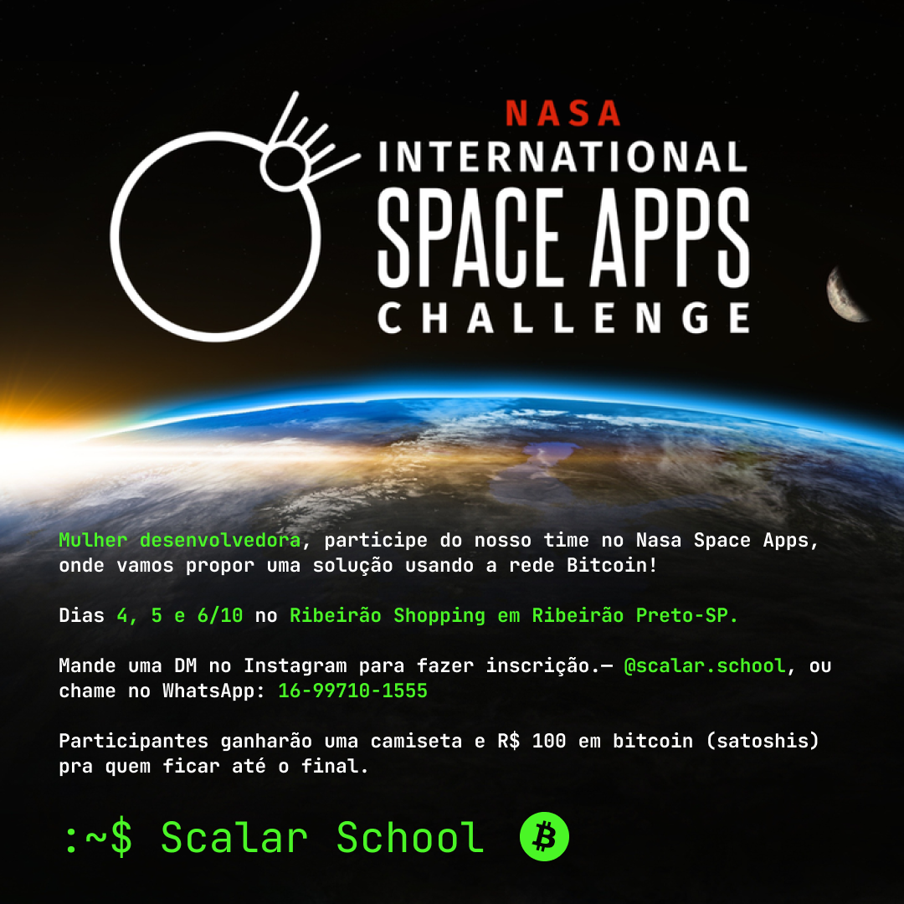

# BDEV101—Fundamentos do Bitcoin

O curso abrange os fundamentos do Bitcoin, sua relevância para os Direitos Humanos e os Direitos das Mulheres, práticas seguras de armazenamento de Bitcoin, execução e verificação de transações, e uma introdução aos conceitos básicos de contratos inteligentes e Bitcoin Script.

# [Inscreva-se agora!](https://forms.gle/WSA3WhHTvaGNKQ9U7) [Clique aqui para preencher o formulário de matrícula.](https://forms.gle/WSA3WhHTvaGNKQ9U7)

# Público-Alvo

**Mulheres** desenvolvedoras e estudantes de tecnologia. Participe das 3 noites e ganhe um certificado de conclusão.**.**

**Não sou mulher, como posso me envolver e apoiar o projeto?**

Para nossos apoiadores, mentores, pessoas interessadas no sucesso do nosso projeto de todos os gêneros, temos um servidor [Discord](https://discord.gg/AdDKAKWUxE) acessível a todos. Entre e se apresente! 

# Pré-Requisitos

O curso é voltado para mulheres que tenham pelo menos um interesse básico em tecnologia e desejam aprender mais sobre Bitcoin. Não há necessidade de conhecimentos profundos em programação ou criptografia, apenas interesse e disposição para aprender e mergulhar em tópicos técnicos.

# Data

29, 30 e 31 de outubro de 2024

# Horário

19h20 às 20h30 (horário de Brasília)

# Vagas Limitadas com Inscrições Até

27 de outubro de 2024

# **Syllabus**

**Noite 1—15/10: Introdução ao Bitcoin e Sua Importância para os Direitos Humanos e Direitos das Mulheres**

- História da rede Bitcoin e conceitos fundamentais.
- Impacto socioeconômico.

**Noite 2—16/10: Operando com Bitcoin na Prática**

- Segurança e armazenamento de bitcoins.
- Realização e verificação de transações.

**Noite 3—17/10: Introdução Técnica para Desenvolvedoras**

- Conceitos básicos de contratos inteligentes no Bitcoin.
- Introdução ao Bitcoin Script.

# Certificado de Conclusão

Veja abaixo um modelo do certificado de conclusão do curso BDEV101 emitido pela Scalar School. A emissão do certificado será feita em até uma semana após a conclusão do curso e enviada para o e-mail informado no formulário de matrícula.

# Conheça a Educadora

**Luciana Ferreira** atua na área de tecnologias financeiras desde 2021, desenvolvendo assistentes virtuais com IA para instituições como Itaú, Bradesco e Banco BMG. Em 2022, passou a focar no desenvolvimento open source em Bitcoin, após concluir o curso "Introdução às Moedas Digitais" da Universidade de Nicosia.

Participou de programas da Chaincode Labs e Base58, e contribuiu para a comunidade com a tradução de "Mastering the Lightning Network" e como gerente de projetos voluntária no WalletScrutiny, que verifica a segurança de código de carteiras de Bitcoin. Foi diretora de programas na Vinteum, organizando o SatsHack 2023 e promovendo boas práticas na comunidade open source.

Atualmente, lidera a Scalar School, capacitando mulheres em tecnologias Bitcoin com apoio da Human Rights Foundation.

# **Contato**

Para mais informações:

**E-mail:** luciana@scalarschool.org

**WhatsApp:** (16)99710-1555

**Redes Sociais:** [Instagram](https://www.instagram.com/scalar.school/) | [Twitter](https://twitter.com/scalarschool) | [LinkedIn](https://www.linkedin.com/in/lucianareyferreira/)

**Chave Pública Nostr**: npub1v799vkkxjasjtjcrr4wh2ral5vcklqhg0tyyvc6gvfe5qfrd57mqutqrup 

# Grupo WhatsApp Exclusivo Para Mulheres

](assets/qrcode.png)

[https://chat.whatsapp.com/F7IctuftBsNCkpQ1Yh7yuN](https://chat.whatsapp.com/F7IctuftBsNCkpQ1Yh7yuN)

# Leitura Recomendada

[**Tecnologia Bitcoin: Fundamentos e Trilhas de Carreira para Desenvolvedoras**](https://drive.google.com/file/d/1MjUNi0wjeJqSTfNph5nu5CU7Ge-udg6W/view?usp=sharing)

[**O Modelo de Cebola para a Progressão de Carreira no Desenvolvimento Open Source de Bitcoin**](https://scalarschool.medium.com/o-modelo-de-cebola-para-o-desenvolvimento-bitcoin-open-source-98cf2514e140)

# Licença

Todos os materiais da Scalar School são produzidos sob a [licença MIT](https://www.mit.edu/~amini/LICENSE.md), exceto a marca.  

---

# Nasa Space Apps Hackathon

