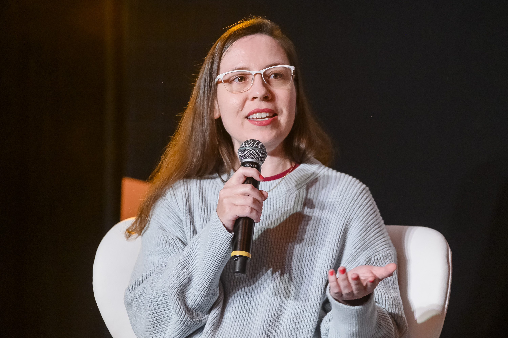

# BDEV101—Fundamentos do Bitcoin

O curso abrange os fundamentos do Bitcoin, sua relevância para os Direitos Humanos e os Direitos das Mulheres, práticas seguras de armazenamento de Bitcoin, execução e verificação de transações, e uma introdução aos conceitos básicos de contratos inteligentes e Bitcoin Script.

# [Inscreva-se agora! Clique aqui para preencher o formulário de matrícula.](https://forms.gle/WSA3WhHTvaGNKQ9U7)

# Patrocinadores

Somos orgulhosamente financiadas pela Human Rights Foundation para que o curso possa ser oferecido gratuitamente. 

# Público-Alvo

**Mulheres** desenvolvedoras e estudantes de tecnologia. Participe das 3 noites e ganhe um certificado de conclusão.

**Não sou mulher, como posso me envolver e apoiar o projeto?**

Para nossos apoiadores, mentores, pessoas interessadas no sucesso do nosso projeto de todos os gêneros, temos um servidor [Discord](https://discord.gg/AdDKAKWUxE) acessível a todos. Entre e se apresente! 

# Pré-Requisitos

O curso é voltado para mulheres que tenham pelo menos um interesse básico em tecnologia e desejam aprender mais sobre Bitcoin. Não há necessidade de conhecimentos profundos em programação ou criptografia, apenas interesse e disposição para aprender e mergulhar em tópicos técnicos.

# Data

29, 30 e 31 de outubro de 2024

# Horário

19h20 às 20h50 (horário de Brasília)

# Vagas Limitadas com Inscrições Até

12 de dezembro de 2024

# **Syllabus**

**Noite 1—29/10: Introdução ao Bitcoin e Sua Importância para os Direitos Humanos e Direitos das Mulheres**

- História da rede Bitcoin e conceitos fundamentais.
- Impacto socioeconômico.
- Tecnologias de liberdade.

**Noite 2—30/10: Operando com Bitcoin na Prática**

- Segurança e armazenamento de bitcoins.
- Realização e verificação de transações.

**Noite 3—31/10: Introdução Técnica para Desenvolvedoras**

- Conceitos básicos de contratos inteligentes no Bitcoin.
- Introdução ao Bitcoin Script.
- Avaliação valendo nota para o certificado.

# Certificado de Conclusão

Veja abaixo um modelo do certificado de conclusão do curso BDEV101 emitido pela Scalar School. A emissão do certificado será feita em até uma semana após a conclusão do curso e enviada para o e-mail informado no formulário de matrícula.

# Conheça a Educadora

**Luciana Ferreira** atua na área de tecnologias financeiras desde 2021, desenvolvendo assistentes virtuais com IA para instituições como Itaú, Bradesco e Banco BMG. Em 2022, passou a focar no desenvolvimento open source em Bitcoin, após concluir o curso "Introdução às Moedas Digitais" da Universidade de Nicosia.

Participou de programas da Chaincode Labs e Base58, e contribuiu para a comunidade com a tradução de "Mastering the Lightning Network" e como gerente de projetos voluntária no WalletScrutiny, que verifica a segurança de código de carteiras de Bitcoin. Foi diretora de programas na Vinteum, organizando o SatsHack 2023 e promovendo boas práticas na comunidade open source.

Atualmente, lidera a Scalar School, capacitando mulheres em tecnologias Bitcoin com apoio da Human Rights Foundation.

# Conheça a Board Member

**Rachel Rybarczyk** é uma desenvolvedora altamente qualificada do protocolo Stratum V2, com seis anos de experiência na indústria de mineração de Bitcoin. Ela desempenhou papéis cruciais no suporte a diversas operações de mineração de Bitcoin em grande escala, onde projetou sistemas personalizados de gerenciamento de mineradores e energia. Rachel também é membro do conselho da Scalar School, uma iniciativa educacional voltada para empoderar mulheres no Sul Global por meio do ensino da tecnologia Bitcoin. Seu trabalho continua a influenciar tanto projetos de código aberto quanto avanços no setor privado, tornando-a uma figura significativa no espaço do Bitcoin.

# **Contato**

Para mais informações:

**E-mail:** luciana@scalarschool.org

**WhatsApp:** (16)99710-1555

**Redes Sociais:** [Instagram](https://www.instagram.com/scalar.school/) | [Twitter](https://twitter.com/scalarschool) | [LinkedIn](https://www.linkedin.com/in/lucianareyferreira/)

**Chave Pública Nostr**: npub1v799vkkxjasjtjcrr4wh2ral5vcklqhg0tyyvc6gvfe5qfrd57mqutqrup 

# Grupo WhatsApp Exclusivo Para Mulheres

](assets/qrcode.png)

[https://chat.whatsapp.com/F7IctuftBsNCkpQ1Yh7yuN](https://chat.whatsapp.com/F7IctuftBsNCkpQ1Yh7yuN)

# Leitura Recomendada

[**Tecnologia Bitcoin: Fundamentos e Trilhas de Carreira para Desenvolvedoras**](https://drive.google.com/file/d/1MjUNi0wjeJqSTfNph5nu5CU7Ge-udg6W/view?usp=sharing)

[**O Modelo de Cebola para a Progressão de Carreira no Desenvolvimento Open Source de Bitcoin**](https://scalarschool.medium.com/o-modelo-de-cebola-para-o-desenvolvimento-bitcoin-open-source-98cf2514e140)

# Por que o Bitcoin é uma Tecnologia de Liberdade? 

Tecnologias de liberdade referem-se a ferramentas e inovações tecnológicas que promovem a autonomia individual, a privacidade e a descentralização do controle. Elas são desenhadas para devolver poder às mãos dos usuários, removendo intermediários que controlam ou monitoram o acesso a bens e informações. O Bitcoin é um exemplo poderoso de tecnologia de liberdade, oferecendo às pessoas uma maneira de proteger seus ativos e realizar transações sem depender de instituições centralizadas. No ecossistema do Bitcoin, existem integrações com outras tecnologias de liberdade como por exemplo ecash para transações financeiras privadas e Nostr, um protocolo de comunicação descentralizado e incensurável que, além das aplicações potenciais, tem servido como uma rede social alternativa em que as pessoas podem mandar satoshis umas às outras como forma de apreciação por seus conteúdos. 

Programas focados na atração de mulheres para o ecossistema de tecnologias de liberdade não são apenas uma questão de equidade de gênero, mas também de melhorar a qualidade das soluções tecnológicas e ampliar seu impacto social. Diversidade de gênero em equipes de desenvolvimento já demonstrou, em diversas áreas da tecnologia, que a inclusão de perspectivas variadas leva à criação de soluções mais robustas, seguras e inovadoras. Mulheres que já estão ativamente desenvolvendo no ecossistema Bitcoin têm contribuído com inovações importantes, como o desenvolvimento de interfaces de carteiras mais acessíveis e melhorias em protocolos de segurança, oferecendo soluções que atendem às necessidades de um público mais amplo e variado.

No campo da criptografia e descentralização, a diversidade de pensamentos é essencial para criar tecnologias que sejam verdadeiramente resilientes e universais. A ausência de mulheres neste espaço limita o potencial criativo e a capacidade de encontrar soluções que resolvam problemas reais enfrentados por diferentes comunidades ao redor do mundo. Quanto mais mulheres participarem ativamente no desenvolvimento de tecnologias descentralizadas, mais robustas, inclusivas e transformadoras essas soluções serão para a sociedade como um todo.

Afinal, a liberdade tecnológica só é verdadeiramente alcançada quando todas as pessoas têm a oportunidade de participar de sua criação e usufruir de seus benefícios. Incluir mais mulheres no desenvolvimento de tecnologias de liberdade, como o Bitcoin, não apenas expande o impacto dessas tecnologias, mas também constrói um futuro mais igualitário, seguro e inovador para todos.

# Materiais De Apoio

[Apresentação Stellar](https://docs.google.com/presentation/d/1HMkKrF3aDKOnokTXLTiuiK0U7mDoMEgTSb1pvedbuRU/edit?usp=sharing)

# Orgulhosamente Financiadas Pela

# Licença

Todos os materiais da Scalar School são produzidos sob a [licença MIT](https://www.mit.edu/~amini/LICENSE.md), exceto a marca.  

---
